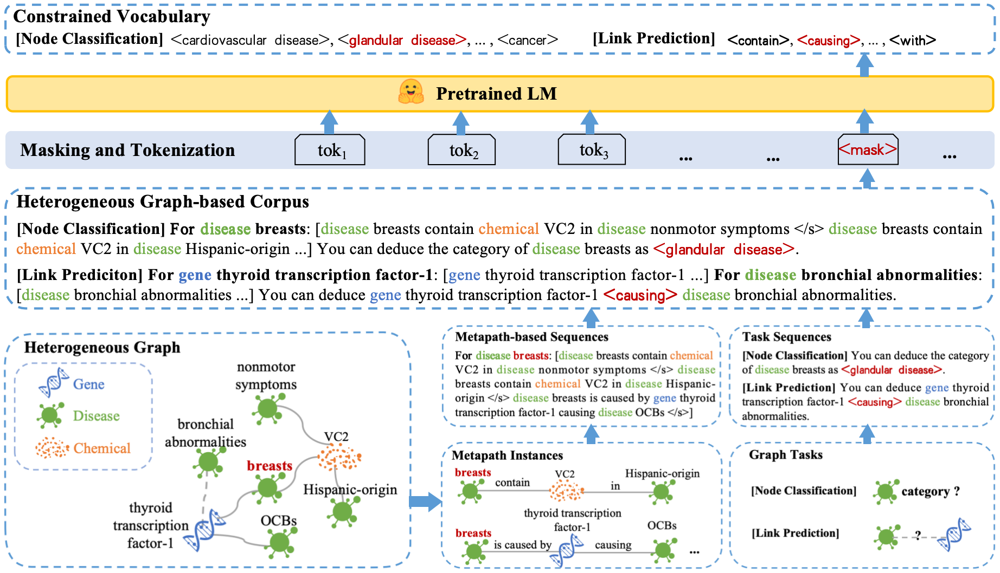

# Masked Language Models are Good Heterogeneous Graph Generalizers
This repository is the official implementation of **Masked Language Models are Good Heterogeneous Graph Generalizers**. 



<div align="center">
Figure 1: The overall framework of the proposed MLM4HG. We first convert HGs from different domains as well as the corresponding graph tasks into a unified textual format, forming a HG-based text corpus. Then we fine-tune a pretrained LM on the corpus by predicting masked label tokens. Finally, the LM can be adapted to unseen target HGs for generalization.
</div>

## Requirements
To install requirements, run following command to create environment for reproduction (for cuda 10.2):
```
conda env create -f MLM4HG.yml
conda activate MLM4HG
pip install torch==1.12.0+cu102 torchvision==0.13.0+cu102 torchaudio==0.12.0 --extra-index-url https://download.pytorch.org/whl/cu102
```
For ```pyg_lib```, ```torch_cluster```, ```torch_scatter```, ```torch_sparse``` and ```torch_spline_conv```, please download [here](https://data.pyg.org/whl/torch-1.12.0%2Bcu102.html) and install locally.
```
pip install pyg_lib-0.1.0+pt112cu102-cp39-cp39-linux_x86_64.whl torch_cluster-1.6.0+pt112cu102-cp39-cp39-linux_x86_64.whl torch_scatter-2.1.0+pt112cu102-cp39-cp39-linux_x86_64.whl torch_sparse-0.6.16+pt112cu102-cp39-cp39-linux_x86_64.whl torch_spline_conv-1.2.1+pt112cu102-cp39-cp39-linux_x86_64.whl
```


## Data Preperation
We have prepared the processed data for fine-tuning and adaptation in the ```data``` folder. If you wish to conduct experiments on your own dataset, you can refer to the implementation provided in ```heterogeneous_graph_based_corpus_construction.py```.

For example, you can run the following commands to construct heterogeneous graph-based corpus for ```IMDB```:
```
cd pre_data
python heterogeneous_graph_based_corpus_construction.py
```


## Cross-domain and Multi-task Fine-Tuning
To evaluate the model's generalization ability across different domains and graph tasks, we conduct multi-task fine-tuning on various source HGs and evaluate it on a target HG. The source and target HGs are from distinct domains. 

Before fine-tuning, you need to download the pretrained [LM](https://huggingface.co/distilbert/distilroberta-base/tree/main) to the local folder ```distilroberta-base```.

Then, run the following commands to fine-tune LM on source HG corpus across node classification and link prediction tasks:
```
python fine_tuning.py
```

Then, you can save the fine-tuned model in the local folder ```MLM4HG/model_output/imdb```.

## Adapting to Unseen Target Heterogeneous Graphs
We performed node classification and link prediction tasks on unseen target HGs in both few-shot and zero-shot scenarios. For zero-shot scenarios, we directly ask the fine-tuned LM to make predictions within the corresponding constrained vocabulary. For few-shot scenarios, we update the parameters of fine-tuned LM following the same fine-tuning process prior to inference. Here, we present the inference process for the IMDB node classification task under zero-shot settings.

Run the following commands to achieve adapting to unseen target heterogeneous graphs:
```
python adapting.py
```
